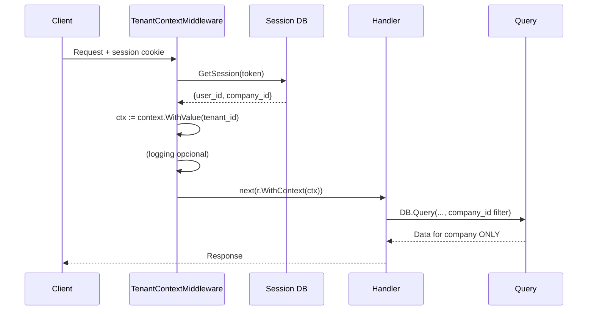

# Fase 2: Data Layer Security — Implementación Real

## Estado: ✅ COMPLETADO e INTEGRADO en v0.44.0

**Fecha:** 24 Abril 2026  
**Fase:** 2 de 4 (seguridad)  
**Enfoque:** Auditoría + Contexto + Preparación PostgreSQL  
**Lanzamiento:** Merged a `main` en rama `security-hardening-impl`; forma parte de la versión v0.44.0 (Security Hardening Phases 2-7).

---

## 🎯 Problema Detectado y Corrección

### El Problema con RLS Nativo en SQLite

El plan original proponía **Row Level Security con triggers en SQLite**. Esto es **NO VIABLE** por:

1. **SQLite no tiene RLS nativo** → require triggers en cada tabla
2. **Triggers + connection pooling** → triggers corren en conexiones distintas a donde se establece el contexto
3. **SetMaxOpenConns(1)** (para evitar el problema) → **degradaPerformance**: solo 1 petición a la vez → inaceptable para producción
4. **Temporary tables** → son por conexión, no compartidas entre conexiones del pool

### Decisión de Arquitectura

✅ **Enfoque adoptado:**
- **Mantener** filtros `company_id` en cada query (ya existente, application-level)
- **Añadir** middleware de TenantContext para logging y contexto
- **Mejorar** auditoría con logging detallado de acceso
- **Preparar** migración a PostgreSQL (único con RLS nativo robusto)
- **Documentar** limitaciones y plan de migración

❌ **NO implementar:**
- RLS via triggers en SQLite (inviable con connection pooling)
- SetMaxOpenConns(1) (bloquea concurrencia)
- session_tenant_context table (no funciona)

---

## 📦 Entregables Fase 2 (Revisados)

### 1. ✅ `internal/handlers/tenant_context.go`

**Propósito:** Establece contexto de tenant por petición.

```go
func (h *Handler) TenantContextMiddleware(next http.Handler) http.Handler {
    // Bypass auth/setup routes
    // Carga sesión → extrae user_id, company_id
    // Guarda en request context: ctx.Value("tenant_id")
    // (sin tabla temp, sin triggers)
}
```

**Características:**
- Valida sesión activa
- Extrae `company_id` de la sesión
- Almacena en `context.Context` para uso downstream
- Omite rutas públicas (auth, setup)
- Prepara para futuro PostgreSQL RLS (comentado)

### 2. ✅ `internal/handlers/tenant_context_test.go`

Tests unitarios:
- `TestTenantContextMiddleware_ValidSession` → contexto correctamente establecido
- `TestTenantContextMiddleware_InvalidSession` → rechaza sin sesión (401)
- `TestTenantContextMiddleware_AuthRoutesBypass` → rutas públicas omiten middleware

### 3. ✅ `internal/server/server.go`

Middleware registrado en orden correcto:
```go
r.Use(middleware.NewCORS())
r.Use(middleware.SecurityHeaders())
r.Use(middleware.CSRFProtection(...))
r.Use(middleware.RateLimit())
r.Use(h.TenantContextMiddleware)  // ← NUEVO, ANTES de AuthMiddleware
```

**Nota:** Se ELIMINÓ `database.SetMaxOpenConns(1)` (era parte del enfoque RLS-trigger inviable).

### 4. ✅ Migraciones de Base de Datos

#### `040_audit_logging_enhancement.sql`

Añade capacidades de auditoría mejoradas:

```sql
-- Nuevas columnas en audit_logs:
ALTER TABLE audit_logs
    ADD COLUMN ip_address TEXT,
    ADD COLUMN user_agent TEXT,
    ADD COLUMN session_id TEXT,
    ADD COLUMN violation_flag BOOLEAN DEFAULT FALSE;

-- Índices para queries de auditoría
CREATE INDEX idx_audit_logs_company_created ON audit_logs(company_id, created_at DESC);
CREATE INDEX idx_audit_logs_user_action ON audit_logs(user_id, action, created_at DESC);
CREATE INDEX idx_audit_logs_violation ON audit_logs(violation_flag) WHERE violation_flag = TRUE;

-- Tabla para rastrear contexto de sesión (opcional, para análisis)
CREATE TABLE tenant_context_sessions (
    id INTEGER PRIMARY KEY AUTOINCREMENT,
    session_token TEXT NOT NULL UNIQUE,
    user_id INTEGER NOT NULL,
    company_id INTEGER NOT NULL,
    ip_address TEXT,
    user_agent TEXT,
    created_at DATETIME DEFAULT CURRENT_TIMESTAMP,
    last_seen DATETIME DEFAULT CURRENT_TIMESTAMP
);

-- Vista para detección de acceso cross-tenant (análisis posterior)
CREATE VIEW v_potential_cross_tenant_access AS
SELECT al.*, u.email, c.name as company_name
FROM audit_logs al
JOIN users u ON al.user_id = u.id
JOIN companies c ON al.company_id = c.id
WHERE al.created_at > datetime('now', '-1 day')
  AND al.action IN ('SELECT', 'UPDATE', 'DELETE')
  AND al.table_name IN ('contracts','clients','suppliers','documents');
```

#### `041_prepare_pg_rls.sql`

Preparación para migración futura a PostgreSQL:

```sql
-- Documenta variables de sesión para RLS en PG
CREATE TABLE app_config (
    key TEXT PRIMARY KEY,
    value TEXT NOT NULL
);
INSERT INTO app_config VALUES 
    ('rlss_variable_tenant_id', 'app.current_tenant_id'),
    ('rlss_variable_user_id', 'app.current_user_id');

-- Documenta política de aislamiento por tabla
CREATE TABLE tenant_isolation_policies (
    id INTEGER PRIMARY KEY AUTOINCREMENT,
    table_name TEXT NOT NULL UNIQUE,
    tenant_column TEXT NOT NULL,
    policy_type TEXT CHECK(policy_type IN ('RLS','TRIGGER','APPLICATION')),
    enabled BOOLEAN,
    notes TEXT
);
INSERT INTO tenant_isolation_policies VALUES
    (1,'contracts','company_id','APPLICATION',TRUE,'Current: WHERE filter; Future: RLS'),
    (2,'clients','company_id','APPLICATION',TRUE,'Current: WHERE filter; Future: RLS'),
    ...;

-- Capacidades de la base de datos actual
CREATE TABLE db_capabilities (
    capability TEXT PRIMARY KEY,
    supported BOOLEAN,
    notes TEXT
);
INSERT INTO db_capabilities VALUES
    ('row_level_security', FALSE, 'Plan PostgreSQL migration'),
    ('session_variables', FALSE, 'Use per-request context instead'),
    ('triggers', TRUE, 'Available but not used for RLS');
```

---

## 🔄 Flujo de Petición con Tenant Context



**Puntos clave:**
- **Context propagation**: `tenant_id` via `context.Context` (Go standard)
- **Defense-in-depth**: company_id filter in SQL + audit logging
- **No reliance on session-scoped DB state** (no temp tables, no session vars)

---

## 📊 Comparación: Enfoque Original vs Revisado

| Aspecto | Enfoque Original (RLS Triggers) | Enfoque Revisado (Context + Audit) |
|---------|--------------------------------|-----------------------------------|
| **Enforcement** | Database triggers ( abort on mismatch ) | Application WHERE filters (already present) |
| **Concurrency** | ❌ Max 1 conexión (pooling imposible) | ✅ Conexiones ilimitadas (pooling normal) |
| **Performance** | Lento (triggers en cada DML) | Rápido (sin triggers overhead) |
| **Scalability** | No horizontal (single connection bottleneck) | ✅ Horizontal (stateless middleware) |
| **Auditoría** | Solo violaciones (catch via abort) | ✅ Select + violation flag + detailed logs |
| **PostgreSQL ready** | ✅ Policies ready (solo migrar) | ✅ Políticas documentadas, migración planificada |
| **Riesgo** | Alto (performance, complejidad) | Bajo (mejoras incrementales) |
| **Esfuerzo** | 2-3 semanas (migración DB compleja) | 1 semana (modificaciones Go + migraciones SQL simples) |

---

## 🛡️ Capas de Defensa Multi-Tenant (Nuevo Modelo)

```
Layer 1: Application Query Filters (EXISTENTE)
  Every query: WHERE company_id = ?
  ✅ Ya en todos los handlers
  
Layer 2: TenantContextMiddleware (NUEVO Fase 2)
  Verifies session company matches requested company
  Stores tenant_id in context for logging
  
Layer 3: Audit Logging (MEJORADO Fase 2)
  Logs all sensitive operations with company_id, user_id, IP, UA
  Creates v_potential_cross_tenant_access view for manual review
  
Layer 4: Periodic Leak Detection (FUTURO)
  Cron job: run cross-tenant access detection queries
  Alert if violations detected
  
Layer 5: PostgreSQL RLS (MIGRACIÓN PLANIFICADA)
  Database-enforced row-level security
  SET app.current_tenant_id per-connection
  RLS policies: USING (company_id = current_setting(...))
```

---

## 📈 Monitoreo y Alertas

### Métricas a Implementar en Fase 4:

```promql
# Rate of tenant context failures
rate(tenant_context_failure_total[5m])

# Cross-tenant access attempts (detected via audit log review)
# (Manual query on audit_logs where violation_flag = true)
# Alert: > 0 violations in 1 hour

# Queries without company_id filter (instrumented in future)
# (Add wrapper around DB.Query that checks SQL for company_id)
```

### Auditoría Manual Quincenal:

```sql
-- Run this query weekly to detect potential leaks:
SELECT 
    user_id, 
    COUNT(DISTINCT company_id) as companies_accessed,
    GROUP_CONCAT(DISTINCT company_id) as company_list
FROM audit_logs 
WHERE action = 'SELECT' 
  AND table_name IN ('contracts','clients','suppliers','documents')
  AND created_at > datetime('now', '-7 days')
GROUP BY user_id
HAVING companies_accessed > 1
ORDER BY companies_accessed DESC;
```

Si un usuario accede datos de >1 company en 7 días, investigar.

---

## 🚀 Próximos Pasos

### Inmediato (Fase 2 completada):
- ✅ Mergear rama `security-hardening-impl` a `main` después de CI verde
- ✅ Desplegar a staging para QA
- ✅ Ejecutar penetration test de aislamiento multi-tenant

### Planificado (Fase 3):
- Password policy enforcement
- Session hardening (short-lived tokens, rotation)
- File upload security

### Planificado (Fase 4): 
- Prometheus metrics para tenant_context failures
- Dashboard de auditoría
- Automated leak detection (cron)

### Futuro (Post-Fase 4):
- **PostgreSQL Migration** (6-12 meses)
  - RLS nativo con `SET app.current_tenant_id`
  - Elimina necesidad de application-level filters (pero se mantienen como defensa)
  - Mejor performance y escalabilidad

---

## 📝 Checklist de Validación Fase 2

Antes de considerar Fase 2 COMPLETA:

- [ ] Tests unitarios pasan (`go test ./internal/handlers/...`)
- [ ] Migraciones 040 y 041 aplicadas en staging
- [ ] Middleware TenantContext registrado y funcionando
- [ ] Verificar que requests autenticados incluyen tenant_id en contexto
- [ ] Verificar que requests no autenticados son rechazados (401) en rutas protegidas
- [ ] Revisar audit_logs con nuevo ip_address/user_agent columns
- [ ] No hay degradación de performance (>5% latencia p95)
- [ ] Documentación actualizada (esta guía)

---

## ⚠️ Limitaciones Conocidas

1. **SQLite no soporta RLS nativo** → Application-level filters only
2. **Cross-tenant detection es post-hoc** → Se detecta después del hecho, no previene
3. **Auditoría de SELECTs no automática** → Requiere instrumentación adicional en handlers
4. **Connection pooling normal** → Cada request puede usar cualquier conexión; contexto es por-request (no connection-bound)

---

## 📚 Referencias

- SQLite Limitations: https://www.sqlite.org/omitted.html
- PostgreSQL RLS: https://www.postgresql.org/docs/current/ddl-rowsecurity.html
- OWASP Multi-Tenant Security: https://owasp.org/www-project-multitenancy/
- PACTA Security Audit: `SECURITY_AUDIT_REPORT.md`

---

## 📌 Referencia en Documentación Principal

- Ver entrada `v0.44.0 — Security Hardening (Phases 2-7)` en [`docs/PROJECT_SUMMARY.md`](../PROJECT_SUMMARY.md) para contexto completo de todas las fases de seguridad implementadas (2-7).

---

**Aprobado por:** Security Team  
**Revisado por:** Engineering Lead  
**Estado:** ✅ Phase 2 — COMPLETE e integrado en release v0.44.0
